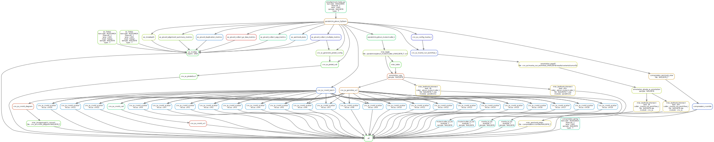

# :crown: WGS Leukemia Tumor Only Königskobra :snake:

Snakemake workflow to analyse hematological malignancies in whole genome data when only tumor sample is available


[](https://opensource.org/licenses/gpl-3.0.html)

## :speech_balloon: Introduction

This snakemake workflow uses modules from hydragenetics to process `.fastq` files and obtain different kind
of variants (SNV, indels, CNV, SV). Alongside diagnosis-filtered `.vcf` files, the workflow produces a
multiqc report `.html` file and some CNV plots. One of the modules contains the **commercial**
[parabricks toolkit](https://docs.nvidia.com/clara/parabricks/3.7.0/index.html) which can be replaced by
opensource GATK tools if required. The following modules are currently part of this pipeline:

- annotation
- cnv_sv
- compression
- misc
- parabricks
- prealignment
- qc

## :heavy_exclamation_mark: Dependencies

In order to use this module, the following dependencies are required:

[](https://github.com/hydra-genetics/)
[](https://pandas.pydata.org/)
[](https://docs.nvidia.com/clara/parabricks/3.7.0/index.html)
[](https://www.python.org/)
[](https://snakemake.readthedocs.io/en/stable/)

## :school_satchel: Preparations

### Sample and unit data

Input data should be added to
[`samples.tsv`](https://github.com/clinical-genomics-uppsala/wgs_leukemia_tumor_only_konigskobra/blob/develop/config/samples.tsv)
and
[`units.tsv`](https://github.com/clinical-genomics-uppsala/wgs_leukemia_tumor_only_konigskobra/blob/develop/config/units.tsv).
The following information need to be added to these files:

| Column Id | Description |
| --- | --- |
| **`samples.tsv`** |
| sample | unique sample/patient id, one per row |
| tumor_content | ratio of tumor cells to total cells |
| **`units.tsv`** |
| sample | same sample/patient id as in `samples.tsv` |
| type | data type identifier (one letter), can be one of **T**umor, **N**ormal, **R**NA |
| platform | type of sequencing platform, e.g. `NovaSeq` |
| machine | specific machine id, e.g. NovaSeq instruments have `@Axxxxx` |
| flowcell | identifer of flowcell used |
| lane | flowcell lane number |
| barcode | sequence library barcode/index, connect forward and reverse indices by `+`, e.g. `ATGC+ATGC` |
| fastq1/2 | absolute path to forward and reverse reads |
| adapter | adapter sequences to be trimmed, separated by comma |

### Reference data

Reference files should be specified in
[`config.yaml`](https://github.com/clinical-genomics-uppsala/wgs_leukemia_tumor_only_konigskobra/blob/develop/config/config.yaml)

1. A `.fasta` reference file of the human genome is required as well as an `.fai` file and an bwa index of this
file.
2. A `.vcf` file containing known indel sites. For GRCh38, this file is available as part of the Broad GATK
resource bundle at
[google cloud](https://storage.googleapis.com/genomics-public-data/resources/broad/hg38/v0/Homo_sapiens_assembly38.known_indels.vcf.gz).
3. An `.interval_list` file containing all whole genome calling regions. The GRCh38 version is also available at
[google cloud](https://storage.googleapis.com/genomics-public-data/resources/broad/hg38/v0/wgs_calling_regions.hg38.interval_list).
4. The `trimmer_software` should be specified by indicating a rule which should be used for trimming. This
pipeline uses `fastp_pe`.
5. `.bed` files defining regions of interest for different diagnoses. This pipeline is assuming `ALL` and `AML`
and different gene lists for SNVs and SVs.
6. For pindel, a `.bed` file containing the region that the analysis should be limited to.
7. [simple_sv_annotation](https://github.com/AstraZeneca-NGS/simple_sv_annotation) comes with panel and a fusion
pair list which should also be included in the `config.yaml`.
8. Annotation with [SnpEff](http://pcingola.github.io/SnpEff/) a database is needed which can be downloaded through
the cli.
9. For [VEP](https://www.ensembl.org/info/docs/tools/vep/index.html), a cache resource should be downloaded prior
to running the workflow.

## :rocket: Usage

To run the workflow,
[`resources.yaml`](https://github.com/clinical-genomics-uppsala/wgs_leukemia_tumor_only_konigskobra/blob/develop/config/resources.yaml)
is needed which defines different resources as default and for different rules. For parabricks, the `gres`
stanza is needed and should specify the number of GPUs available.

```bash
snakemake --profile my-profile
```

### Relevant output files

| File | Description |
|---|---|
| `cnv_sv/cnvkit_diagram/{sample}_T.png` | chromosome diagram from cnvkit |
| `cnv_sv/cnvkit_scatter/{sample}_T_{chromosome}.png` | scatter plot per chromosome from cnvkit |
| `cnv_sv/cnvkit_vcf/{sample}_T.vcf` | `.vcf` output from cnvkit |
| `cnv_sv/pindel/{sample}.vcf` | `.vcf` output from pindel |
| `compression/crumble/{sample}_{type}.crumble.cram` | crumbled `.cram` file |
| `compression/crumble/{sample}_{type}.crumble.cram.crai` | index for crumbled `.cram` file |
| `compression/spring/{sample}_{flowcell}_{lane}_{barcode}_{type}.spring` | compressed `.fastq` file pair |
| `tsv_files/{sample}_mutectcaller_t.aml.tsv` | `.tsv` file for excel containing SNVs from mutect2 for AML |
| `tsv_files/{sample}_mutectcaller_t.all.tsv` | `.tsv` file for excel containing SNVs from mutect2 for ALL |
| `tsv_files/{sample}_manta_t.aml.tsv` | `.tsv` file for excel containing SVs from manta for AML |
| `tsv_files/{sample}_manta_t.all.tsv` | `.tsv` file for excel containing SVs from manta for ALL |
| `qc/multiqc/multiqc.html` | `.html` report from MultiQC |

## :judge: Rule Graph


